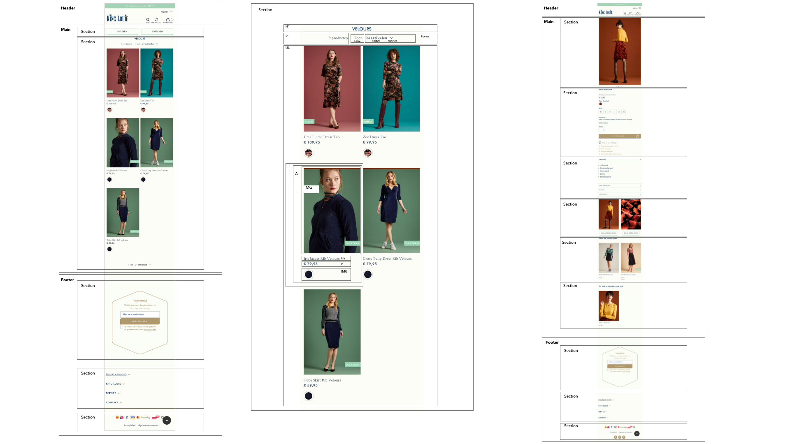

# Procesverslag
**Auteur:** Faye Kostopoulos

Markdown cheat cheet: [Hulp bij het schrijven van Markdown](https://github.com/adam-p/markdown-here/wiki/Markdown-Cheatsheet). Nb. de standaardstructuur en de spartaanse opmaak zijn helemaal prima. Het gaat om de inhoud van je procesverslag. Besteedt de tijd voor pracht en praal aan je website.

## Startniveau
Als startniveau kies ik voor de blauwe piste, ik vind code schrijven lastig. Wanneer ik veel opzoek en lees erover lukt het meestal wel, met hulp kom ik er in ieder geval. Ik denk dat ik af en toe de rode piste wel aan kan wanneer mijn kennis weer opgefrist is.

## Mijn focus
Bij het uitwerken van mijn website ga ik extra aandacht besteden aan de surface laag.

## Mijn website
Ik kies voor het namaken van een bestaande website. De kledingwebsite van kinglouie.
link: https://www.kinglouie.nl/

## Breakdownschets (week 1)

## Intake (week 1)

**Screenshot(s) van de eerste pagina (small screen):**

**Screenshot(s) van de tweede pagina (small screen):**

## Bronnenlijst
1. visually hidden - https://levelup.gitconnected.com/a11y-visually-hidden-elements-aea4ee784142
2. bronnen styling weg - https://www.codegrepper.com/code-examples/actionscript/css+remove+styling+from+button
3. js toggle - https://css-tricks.com/video-screencasts/150-hey-designers-know-one-thing-javascript-recommend/
4. voor verschillende onderdelen als formulieren -https://www.w3schools.com/howto/
5.go back to top- https://stackoverflow.com/questions/32102747/how-to-make-a-back-to-top-button-using-css-and-html-only
6.https://commons.wikimedia.org/wiki/File:Chevron_up_font_awesome.svg voor een chevron, de backt to top button
7. Verder komen alle andere afbeeldingen van kinglouie.nl
8. De fonts komen van fonts.google.com, https://fonts.googleapis.com/css2?family=Crimson+Text:ital@0;1&display=swap, https://fonts.googleapis.com/css2?family=Open+Sans:ital,wght@0,300;0,400;1,300;1,400&display=swap

## Eindgesprek (week 7/8)

Ik vond het over het algemeen best prima gaan, ik ben naar mijn mening steeds verder gekomen met het leren over code schrijven. Wel merk ik dat ik er veel tijd aan moest besteden om achteraf best wel makkelijke elementen te achterhalen. Js vind ik nog steeds het lastigste onderdeel maar er is gelukkig veel over te vinden online. Ik merkte dat ik er zo best wel goed uit kon komen.

**Overzichtspagina:**

**Detailpagina:**

## Voortgang 3 (week 6)

### Stand van zaken

Ik ben nu veel verder met me code, ik heb al js toegevoegd. Dit vond ik lastig maar met hulp en het internet kom je al erg ver. Ik loop er wel steeds tegen aan dat de website die ik aan het namaken ben steeds verandert. Ik moet dan ook steeds me code aanpassen, dit dan omdat ik van sommige toevoegingen denk dat dat goeie afwisseling is in de code.

**Overzichtspagina:**

**Detailpagina:**

### Agenda voor meeting

| Faye      | Daniel          | Jelle    | student 4        |
| ---            | ---                | ---          | ---              |
| -aanpassingen aan de website zelf maken  |-positionering onder header   | -navigatie   | -navigatie   |
| - grid | dit als er tijd is | -kleur svg |-sections en articles | sections
| -y-scaling            | -flex               | cms          | verstopppen h1              |

### Verslag van meeting

De meeting was erg handig, ik ben meer te weten gekomen over sections en articles. Ik vond het fijn dat ik niet de enige was met vragen over de header en de navigatie daarvan. Ik heb veel geleerd en ben van plan dit zsm toe te passen in mijn site.

## Voortgang 2 (week 5)

Het html en css gaat tot nu toe okay, het is echt weer wennen. Vaak moet ik even opzoeken wat de namen ook al weer zijn van properties. Ik heb me vooral gefocused op de basis van de 2 pagina's.

**Overzichtspagina**

Ik ben bij de eerste pagina veel verder gekomen met de css, een deel daarvan kon ik gelijk gebruiken op mijn tweede pagina. Hier ben ik nog niet heel diep de css in gegegaan. Er staat alleen wat ik al op mijn eerste pagina heb, wat dus wordt herhaald.

**Overzichtspagina**

**Detailpagina**

## Voortgang 1 (week 3)

### Stand van zaken

Het opzetten van html ging oke, ik moest veel opzoeken maar het gaat steeds beter. Ik heb tot nu alleen de html van de eerste pagina gedaan. Ik ga de komende weken snel met de css aan de slag.

**Overzichtspagina:**

### Agenda voor meeting

-samen met je groepje opstellen-

| Faye      | Daniel          | Jelle    | student 4        |
| ---            | ---                | ---          | ---              |
| -aanpassingen aan de website zelf maken  |-positionering onder header   | -navigatie   | -navigatie   |
| - grid | dit als er tijd is | -kleur svg |-sections en articles | sections
| -y-scaling            | -flex               | cms          | verstopppen h1              |

### Verslag van meeting

Na de meeting kon ik goed verder aan de slag met grid en wist ik ook articles ipv secties aan te passen.

